

  <h1>
  <h1>대드론 체계 방어 시스템 구축을 위한 레이저 대공무기 설치 지점 탐색

## 발표 자료 및 최종 보고서

- 발표 자료: [발표 자료]()
- 최종 보고서: [최종 보고서](https://github.com/HWDFinalProject/ADDS/blob/main/Document/%EC%B5%9C%EC%A2%85%EB%B3%B4%EA%B3%A0%EC%84%9C.pdf)

## 목차
[1. 프로젝트 개요](#1-프로젝트-개요) 
[2. 다층 방공 시스템 설계](#2-다층-방공-시스템-설계) 
[3. 옥상 면적 탐지 모델 구축](#3-옥상-면적-탐지-모델-구축) 
[4. 적합 건물 선정](#4-적합-건물-선정) 
[5. 성과 및 전망](#5-성과-및-전망) 
[6. 출처](#6-출처) 

---

## 1. 프로젝트 개요

- 핵심 목표: 무인기 공격에 대비한 레이저 대공무기 천광의 최적 설치 지점 탐색

### 왜 레이저 무기인가?

> 1. 낙탄 위험이 없다.
> 2. 소음이 발생하지 않는다.
> 3. 정확한 타격이 가능하다.
> 4. 신속 대응이 가능하다.

### 천광(天光)
대한민국의 국방과학연구소와 한화에어로스페이스가 개발한 한국형 레이저 대공 무기체계, 공중 위협(무인기)을 실시간으로 탐지, 추적, 무력화할 수 있는 첨단 방어 시스템이다. 
> 1. 타 레이저 대공무기와 비교했을 때, 높은 가격 경쟁력
> 2. 드론을 격추시키기에 적합한 출력
> 3. 국내 생산 --> 공급 용이, 국방력 강화
*본 프로젝트에서는 현재 개발이 완료된 Block-I(설치형)를 기준으로 함*

### 프로세스 설계
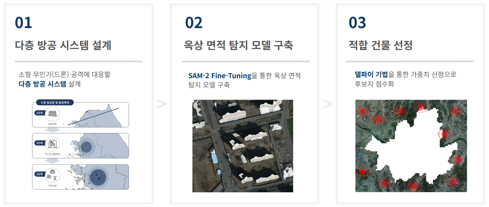

## 2. 다층 방공 시스템 설계
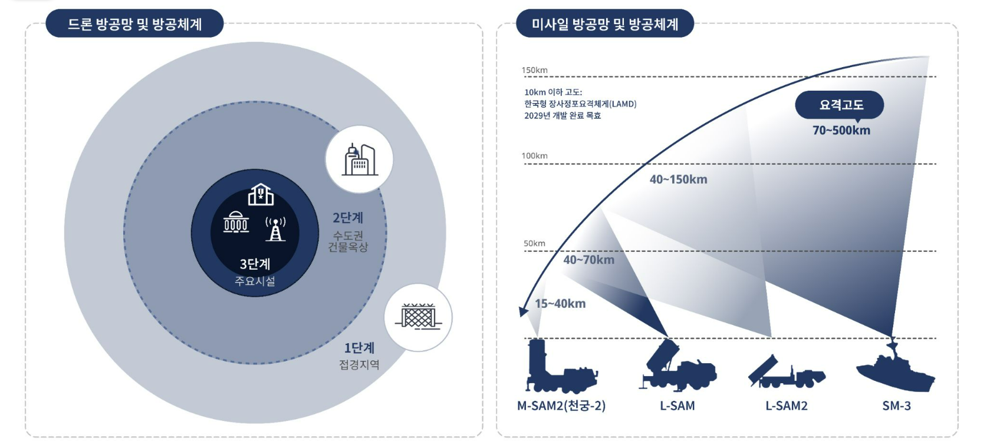
기존의 미사일 방공체계는 비교적 정교하게 구축되어 있으나, 드론을 활용한 위협에 대응하는 방공체계는 아직 미비한 수준이다. 이에 본 프로젝트에서는 효과적인 드론 방공을 위해 방어 체계를 3단계로 구분하여 설계하였다. 

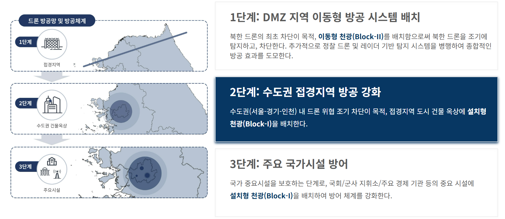
### 1단계: DMZ 지역 이동형 방공 시스템 배치
DMZ 지역에 이동형(Block-II) 방공 시스템을 배치하여 초기 침투를 차단하고, 북한 드론이 남하하기 전에 신속하게 탐지 및 요격할 수 있도록 한다. 이동형 시스템은 트럭 또는 장갑차에 탐재되어 유동적으로 운용 가능하며, 다양한 지형과 작전 상황에 대응할 수 있도록 설계된다. 

### 2단계: 수도권 접경지역 방공 강화
수도권 접경지역 주요 건물에 설치형(Block-I) 방공 시스템을 구축하여, 1단계에서 완전히 차단하지 못한 드론 위협을 수도권 접근 전에 방어한다. 특히, 본 프로젝트에서는 수도 서울을 최우선 방어 대상으로 설정하고, 서울 인근 접경지역 고층 건물 옥상에 방공 시스템을 설치하여 감시 요격 능력을 극대화하고자 한다. 

### 3단계: 주요 국가시설 방어
주요 국가시설 방어 체계를 구축하여 국가 안보를 최종적으로 보호한다. 국회, 정부청사, 군사 지휘소 등 핵심 인프라를 대상으로 천광 시스템 및 추가적인 방공망의 구축하여, 국가 중요시설이 드론 공격으로부터 안전하게 보호될 수 있도록 한다. 

## 3. 옥상 면적 탐지 모델 구축
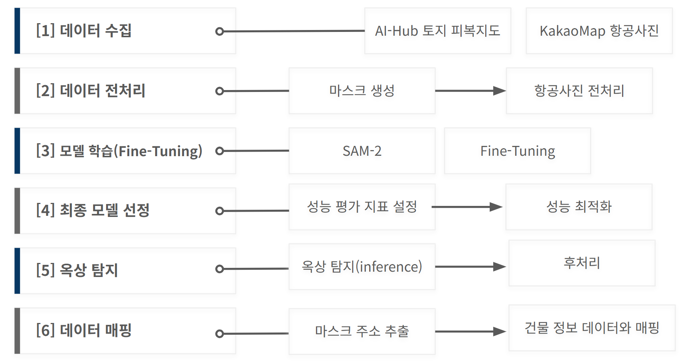
### 개요
* 목표: 항공사진에서 건물을 탐지하고, 해당 건물의 면적을 계산하는 모델 
* 환경: Colab Pro

### 데이터 설명
* 학습 데이터
    - 수집 방법: 다운로드
    - 데이터 출처: [AI-Hub 토지 피복지도 항공위성 이미지](https://www.aihub.or.kr/aihubdata/data/view.do?currMenu=&topMenu=&aihubDataSe=data&dataSetSn=143)
    - 범위: 수도권 지역
    - 정보: 0.51m, 1024 * 1024 해상도
* 탐지 데이터
    - 수집 방법: API + Selenium
    - 데이터 출처: KakaoMap
    - 범위: 서울 외곽 3km
    - 정보: 0.51m, 1024 * 1024 해상도

### 전처리 
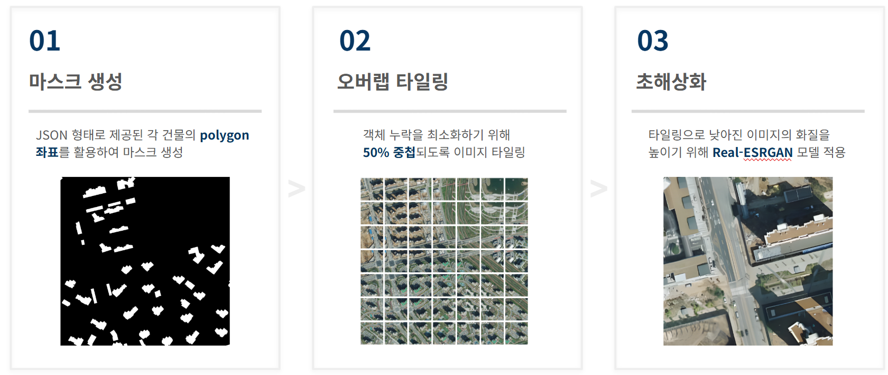
1. 마스크 생성 
json 형태로 제공된 각 건물의 polygon 좌표를 활용하여 마스크 생성
2. 오버랩 타일링 
객체 누락을 최소화하기 위해 50% 중첩되도록 이미지 타일링
3. 초해상화 
타일링으로 낮아진 이미지 화질을 높이기 위해 Real-ESRGAN 모델 적용

### 후처리
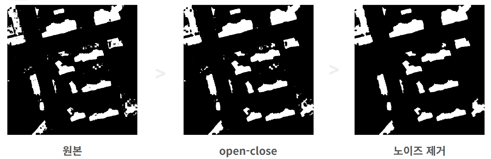
1. open-close 
이미지의 형태학적 연산인 Opening, Closing을 순차적으로 사용하는 방법이다. Opening(열림) 연산은 침식(Erosion) 후 팽창(Dilation)하고, Closing(닫힘) 연산은 팽창(Dilation) 후 침식(Erosion) 하는 방식이다. 
2. 노이즈 제거 

### 모델 정보 
* 사용 기법: SAM-2 Fine-Tuning
* 주요 라이브러리: 
* 성능 평가 지표
    - Pixel Accuracy(PA): 전체 픽셀 중 올바르게 예측된 픽셀 비율
    - Mean Pixel Difference: 실제 객체 영역(Ground Truth)와 예측한 객체의 영역(Prediction)의 픽셀 수 차이
    - Mean Intersection over Union(mIoU): 모든 객체(건물)에 대한 IoU 값을 평균낸 값
    - Mean Success Rate: 실제 객체 영역(Ground Truth) 중 모델이 예측한 객체의 영역(Prediction)의 비율

### 최종 모델 
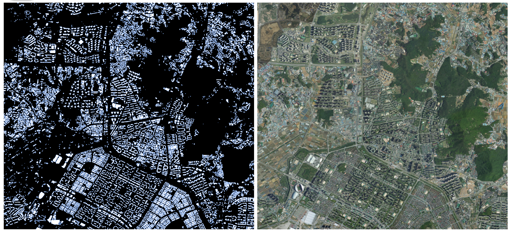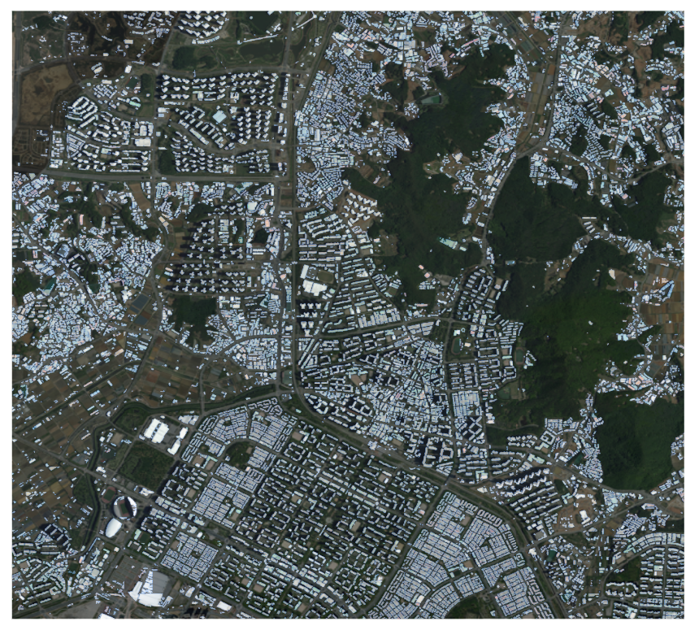
* [모델 기록](https://github.com/HWDFinalProject/ADDS/blob/main/Document/%EB%AA%A8%EB%8D%B8%20%EA%B8%B0%EB%A1%9D.xlsx)
* 최종 하이퍼파라미터
    - model: sam2_hiera_base_plus.pt
    - epoch: 2
    - batch_size: 4
    - learning_rate: 1e-4
    - loss: 0.05
    - post-processing: open-closed
    - weight_decay: 4e-5
* 최종 성능
    - mPA: 0.9502
    - mIoU: 0.7528
    - mPD: 11737.17
    - mSR: 78.6506

### 데이터 매핑
1. 주소 추출
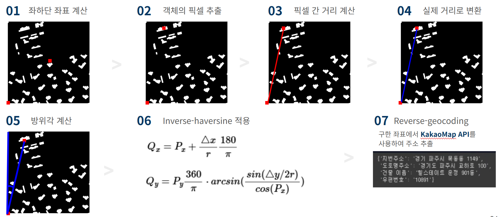

2. 건물 정보 데이터 매핑
* 건물 면적 데이터
    - image_name: 그리드 번호
    - id: 객체 번호
    - lat/lon: 위도, 경도
    - pixels: 면적
    - road_address: 도로명주소
    - address: 지번주소
    - building_name: 건물 이름
* 건물 정보 데이터 
    - 데이터 출처: 건축 허브
    - 시도/시군구/법정동/번/지: 주소
    - 주/기타 구조
    - 주/기타 용도
    - 주/기타 지붕
    - 높이
    - 허가일
    - 사용일
    - 사용승인일 

## 4. 적합 건물 선정
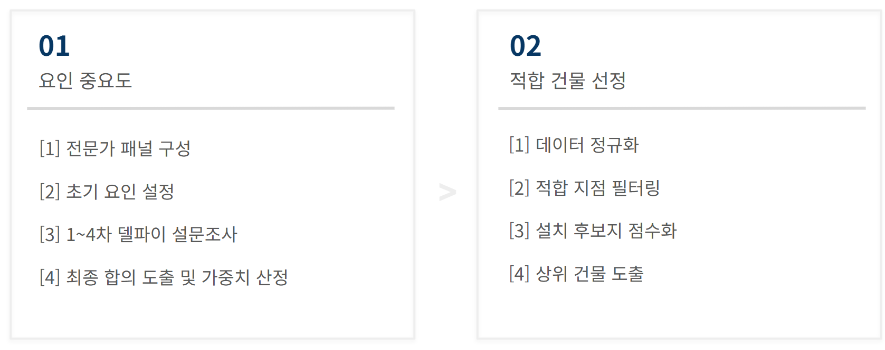
### 델파이 기법

* 기간: 2/4 ~ 2/12(8일)
* 전문가 패널 구성: 건축 분야 전문가(2명), 방산 분야 전문가(2명), 국방 분야 전문가(1명)

#### 요인 설정
- 건물 특성
    - 건물 높이 및 층수
    - 건물 용도
    - 옥상 면적
    - 건물 노후화 정도
    - 건물 구조
    - 내진 설계
- 주변 환경
    - 주요 시설과의 거리
    - 시야각 확보 
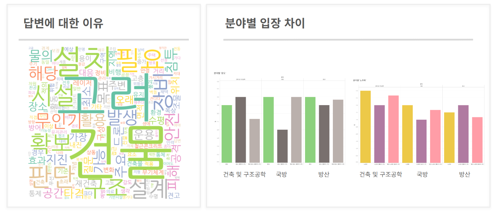

### 상위 건물 도출
#### 데이터 정규화
* 방법: Min-Max 정규화 

|변수|정규화 방법|원본 값(예)|단위|
|---|---|---|---|
|지상층수|값이 클수록 유리(그대로 적용)|11|층|
|옥상 면적|값이 클수록 유리(그대로 적용)|393|$$m^2$$|
|노후화일수|값이 작을수록 유리(역변환: X' = 1 - X')|21542|일|
|시야각|값이 작을수록 유리(역변환: X' = 1 - X')|5|개|
|주요시설과의 거리|값이 클수록 유리(그대로 적용)|1|개|

#### 적합 지점 필터링
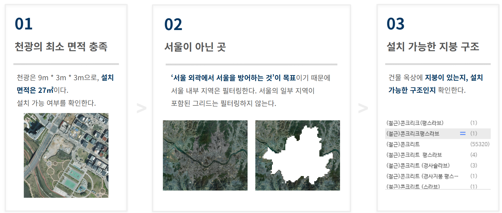

#### 가중치 산정
* 가중치 계산식 
$$W'_j = \frac{W_j}{\Sigma^n_{j=1}W_j}$$

|요인|중요 순위|가중치|
|---|---|---|
|시야각|1|0.2222|
|내진설계|2|0.1944|
|주요 시설|3|0.1667|
|면적|4|0.1389|
|노후화|5|0.1111|
|용도|6|0.0833|
|구조|7|0.0556|
|층수|8|0.0278|

#### 설치 후보지 점수화
$$S_i = \Sigma^n_{j=1}(W_j \cdot X_{ij})$$

#### 상위 설치 지점 도출
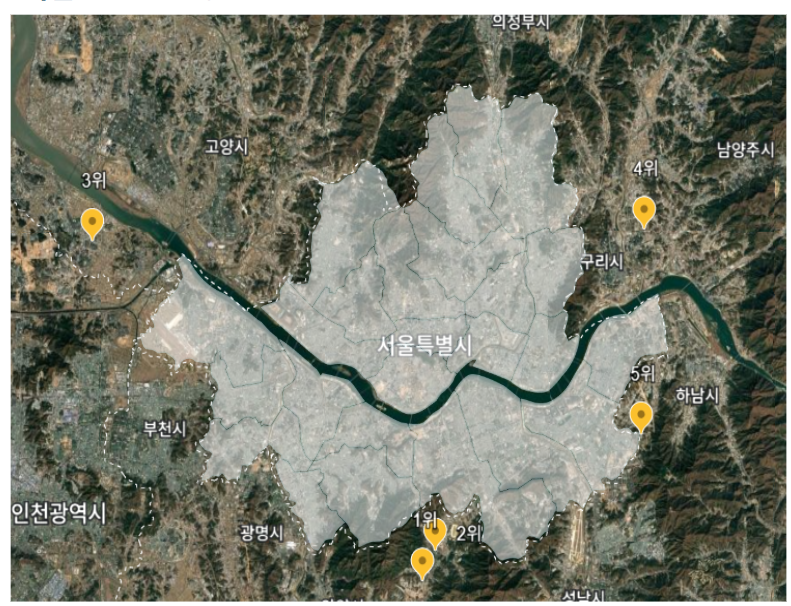

|순위|주소|최종점수|참고사항|
|---|---|---|---|
|1|경기도 과천시 과천대로 12길 117 아이티센타워|1.1847|정부과천청사와 1.18km 거리|
|2|경기도 과천시 별양로 180-1 관문초등학교|1.1349|정부과천청사와 1.29km 거리|
|3|경기도 김포시 풍무1로 73|1.1282|인천과 서울을 연결하는 중요한 관문|
|4|경기 남양주시 다산중앙로82번안길 40 다산별빛초등학교|1.1035|수도권 동쪽 주요 침입 경로 방어, 팔당댐 인근|
|5|경기 하남시 감일백제로 45 감일초등학교|1.1021|수도권 동쪽 주요 침입 경로 방어, 팔당댐 인근|

#### 그리드별 최적 설치 지점 선정
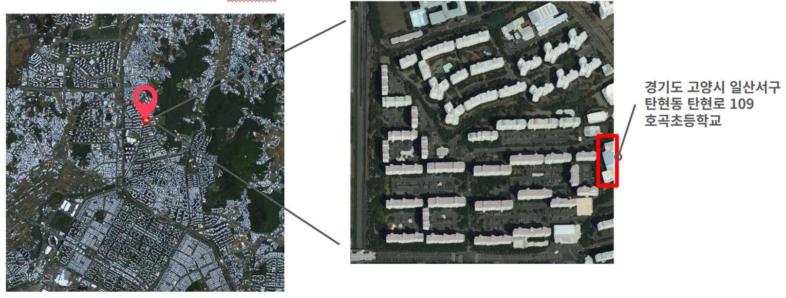

## 5. 성과 및 전망
### 기대효과
#### 시간 및 비용 절약
다차원 분야의 전문가 그룹의 지식이 시스템에 녹아들어 별도 검증없이 결과를 즉시 활용할 수 있도록 설계하였다. 
#### 최소한의 정보로 설치 지점 탐색
항공사진만으로 건물 옥상의 면적을 탐지함으로써 최소한의 정보로 설치 지점 탐색이 가능하다. 
#### 객관적/정량적 건물 적합성 평가 모델 도입
델파이 기법을 통해 가중치를 선정하고 점수화하는 평가 기법을 활용하여 객관적이고 정량적인 평가가 가능하다. 

### 한계점
#### 상대적으로 낮은 옥상 탐지 모델의 성능
선행연구와 비교하여 성능면에서 우위를 확보하지 못하였으나, 추가적인 모델 튜닝이나 처리 방법 도입을 통해 성능 향상의 가능성이 충분하다. 
#### 옥상 위 필수시설 고려 필요
응급구조 헬기 착륙 공간 등과 같은 옥상 위 필수시설을 고려한다면 시스템의 효과가 극대화될 것으로 예상된다. 
#### 직육면체가 아닌 건물 모양 고려 필요
항공사진이기 때문에 직육면체가 아닌 건물 모양이 고려되지 않았다. 다른 각도에서 찍은 항공사진을 추가하여 보완할 필요가 있다. 

## 6. 출처
* Real-ESRGAN: [xinntao/Real-ESRGAN](https://github.com/xinntao/Real-ESRGAN)
* SAM-2: [facebookresearch SAM-2](https://github.com/facebookresearch/sam2)
